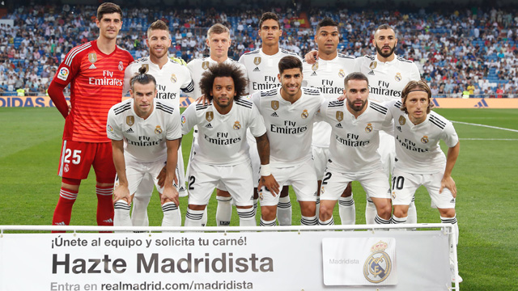
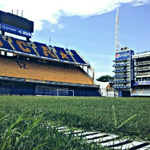
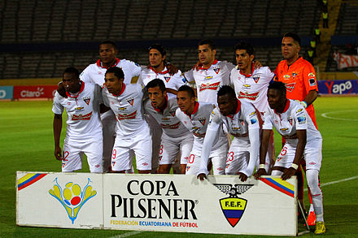

Maria Mancheno
# Soccer Teams

Under this page I will refer to different and historic soccer teams in different cities of the world. Since they are historic they have different founding dates but they go back to old days. Just like any team each of them has a astadium where they play in and a soccer uniform for each of the players. 

## Ontology
* Each soccer team has a date and place of foundation
* Each soccer team has a stadium 
* Each soccer team has a kit and a badge

## Taxonomy
* Origin
	* Year 
	* City 
* Stadium
* Uniform

## Coreography
The order is based on starting with the oldest soccer club in this case Real Madrid to the latest one being Liga de Quito. The information starts with each of the club's origin, then the stadium since it is such an important place for the team (usually built around the same years as the club's foundation) and lastly the uniforms, since they usually undergo a lot of changes from year to year. 

Real Madrid
=============
## Origin
### Year
On 6 March 1902, after a new Board presided by Juan Padrós had been elected, Madrid Football Club was officially founded.
### City 
Real Madrid Club was founded in the city of Madrid, Spain, located in the autonomous community of Madrid. 

## Stadium
The Santiago Bernabéu Stadium is a football stadium in Madrid, Spain. With a current seating capacity of 81,044, it has been the home stadium of Real Madrid since its completion in 1947.[2]
## Uniform
The club has traditionally worn a white home kit since inception. The word real is Spanish for "royal" and was bestowed to the club by King Alfonso XIII in 1920 together with the royal crown in the emblem

Boca Juniors
=============
## Origin
### Year
On 3 April 1905, a group of Greek and Italian boys (more specifically from Genoa) met in order to find a club. The house where the meeting was arranged was Esteban Baglietto's and the other four people who attended were Alfredo Scarpatti, Santiago Sana and brothers Ioannis (Juan) and Theodoros (Teodoro) Farengas from Chios and Konstantinos Karoulias from Samos. Other important founders members include Arturo Penney, Marcelino Vergara, Luis Cerezo, Adolfo Taggio, Giovanelli, Donato Abbatángelo, Bertolini.
### City
Boca Juniors was founded in Buenos Aires, Argentina, in one of the most famous neighborhoods known as Barrio La Boca. 
## Stadium
Boca's home stadium is Estadio Alberto J. Armando, which is colloquially known as La Bombonera.

## Uniform
According to the club's official site, the original jersey colour was a white shirt with thin black vertical stripes, being then replaced by a light blue shirt and then another striped jersey before adopting the definitive blue and gold.

L.D.U Quito 
=============
## Origin
### Year
Liga de Quito's roots lie in a semi-pro sports team based out of the Central University of Ecuador on October 23rd of 1918, headed by Dr. César Jácome Moscoso. Under the leadership of Dr. Bolívar León, the club was officially founded on January 11, 1930.
### City
Liga de Quito was founded in the city of Quito, the capital city of Ecuador.
## Stadium
In 1997, LDU inaugurated their own stadium, Estadio Casa Blanca, in the northern part of the city. It is the largest stadium in Quito in terms of capacity, and the second largest in Ecuador after the Estadio Monumental Banco Pichincha in Guayaquil. 
## Uniform
Dr. León designed the first uniform, placing its crest, a white "U" on an inverted red and blue triangle, on a white shirt, honoring the team's beginnings at the university.

